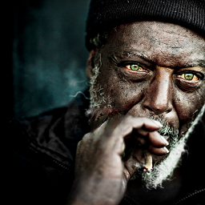
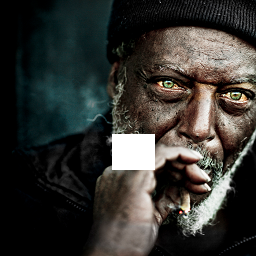
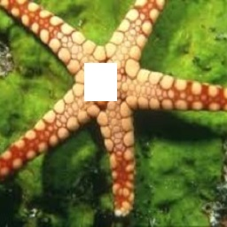

# An Efficient Segmentation Based Pipeline For Image Inpainting

This repository contains the code for an integrated pipeline used to inpaint images. The details of the approach can be found in `report.pdf`.

 
 
 

# Requirements
* Install python3
* Install Tensorflow
* Install tensorflow toolkit neuralgym (run `pip install git+https://github.com/JiahuiYu/neuralgym`)
* Install skimage
* Install OpenCV
* Download the pretrained models for foreground from (https://drive.google.com/drive/folders/1mGomKU3YYtx-b3G27VAHekUmMCANXFx_?usp=sharing) and place it under `fg/model_logs`
* Download the pretrained tagger from (https://drive.google.com/open?id=15LRt2MPTUUBUFCIakLthSYNZ01Ie3yke) and place it under `tag/models`

# Usage
````
usage : run_algo.py input_image output_image [image_mask]

positional arguments:
  input image           Path to image to be infilled
  output_image          Path to ouput file
  
optional arguments:
  image_mask            Path to the mask
````

# Authors
* [Abhinav Gupta](https://github.com/abhigupta768)
* [Vaishnav S. Menon](https://github.com/vaishnavsm)
* [Suyash Shukla](https://github.com/GoCode47)
